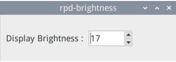
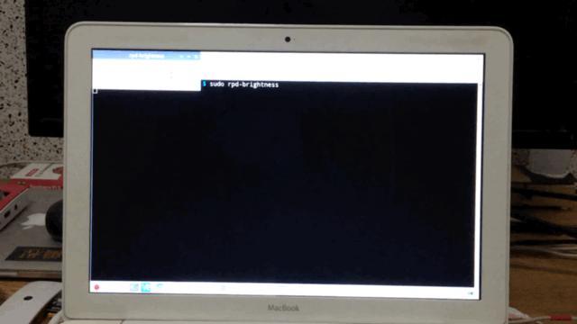

# rpd-brightness

## Compile & Run

1. install libgtk2.0-dev:

```
$ sudo apt install libgtk2.0-dev
```

2. clone this repo:

```
$ git clone https://github.com/kyumdbot/rpd-brightness.git
```

3. compile:

```
$ cd rpd-brightness
$ gcc `pkg-config --cflags --libs gtk+-2.0` rpd-brightness.c -o rpd-brightness
```

4. run:

```
$ sudo ./rpd-brightness
```






